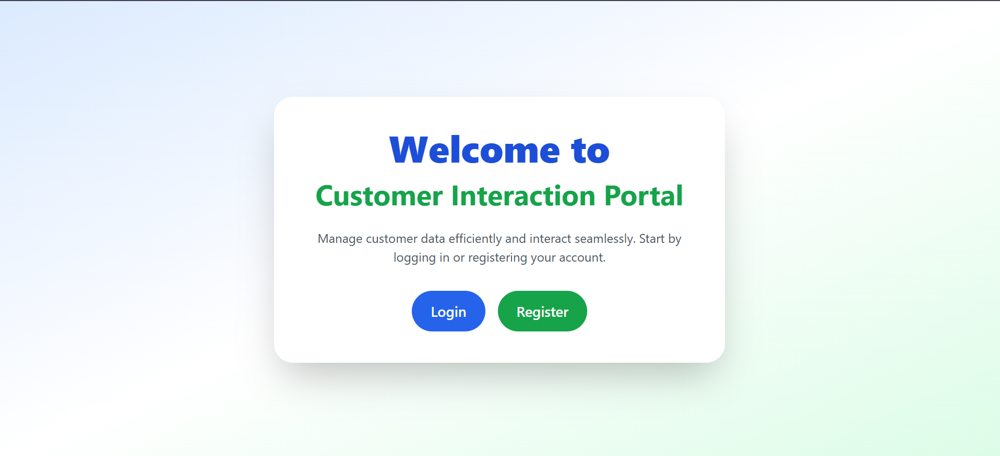
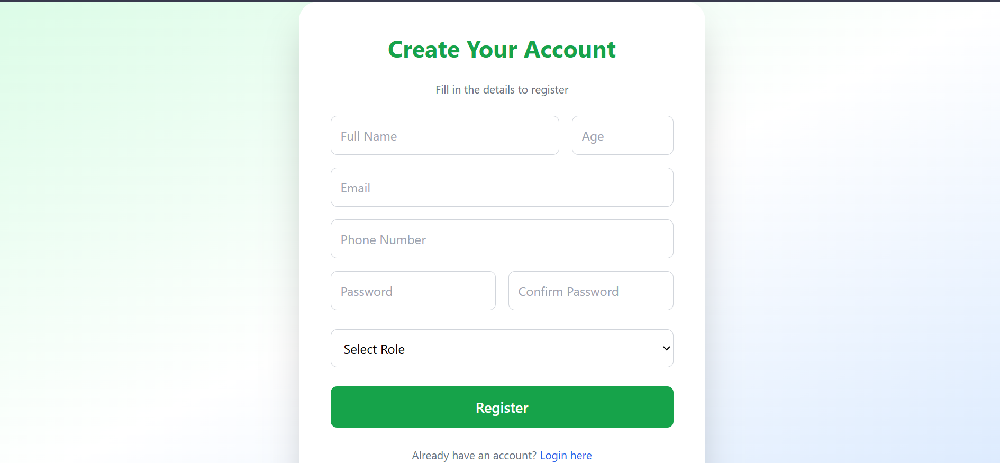
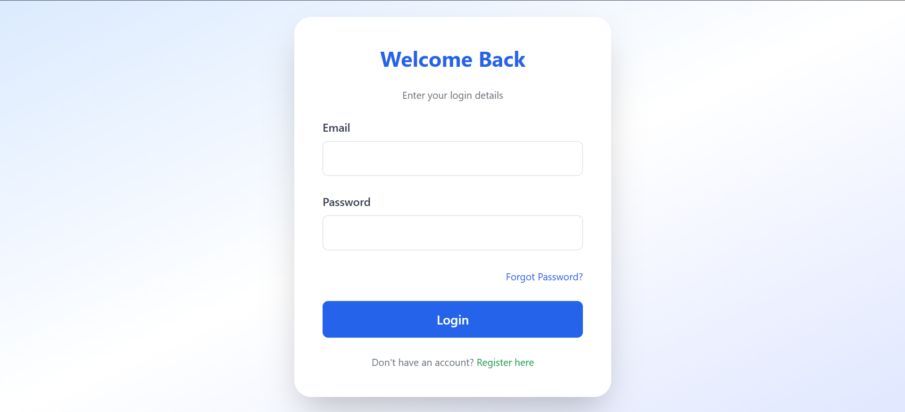
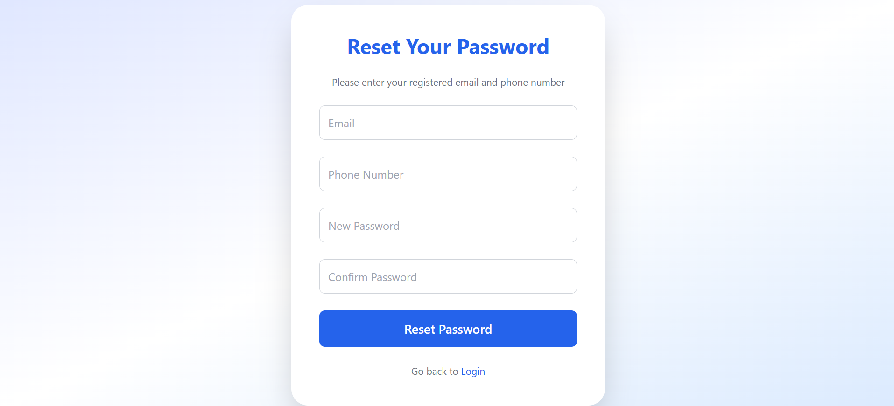
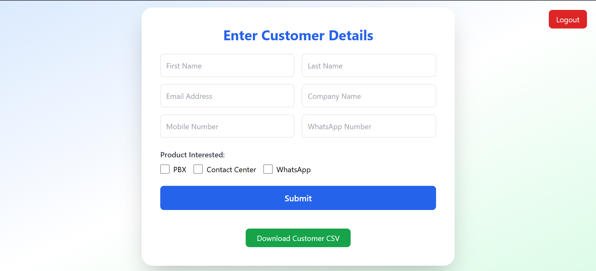
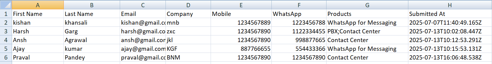

# 💼 Customer Interaction Portal – Frontend

This is the **responsive frontend** for the Customer Interaction Portal, built using **HTML**, **Tailwind CSS**, and **JavaScript**.  
It supports user registration, login, password reset, and customer form submission, and is fully integrated with a live backend API.

🌐 **Live Demo**: [https://customer-interaction-frontend.vercel.app](https://customer-interaction-frontend.vercel.app)

---

## 📸 Screenshots

### 🏠 Home Page


### 📝 Registration Form


### 🔐 Login Page


### 🔁 Forgot Password


### 📋 Customer Dashboard


### 📤 Admin CSV Download


---

## ✨ Features

- Fully responsive Tailwind CSS UI
- Role-based login (admin or customer)
- Customer form with product selection
- Forgot password with email and phone verification
- Admin-only CSV download option
- Connected to live backend (Render)

---

## 🗂️ Folder Structure

```bash
frontend/
├── index.html
├── register.html
├── login.html
├── forgot.html
├── dashboard.html
├── css/
│   └── styles.css
├── js/
│   └── main.js
├── screenshots/
│   ├── index.png
│   ├── register.png
│   ├── login.png
│   ├── forgot.png
│   ├── dashboard.png
│   └── admin-csv.png
